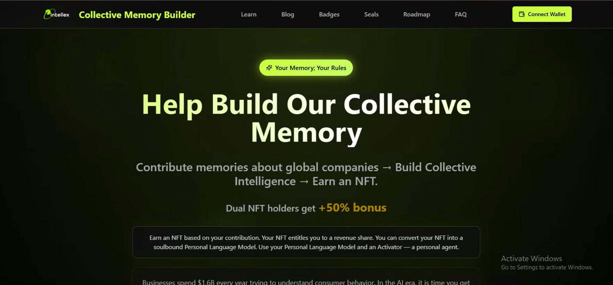

# 🧭 Brainstorm [Project ID: P-BRAINSTORM-001]

Building the Memory Economy | Unlocking Collective Memory as a Liquid Asset | Build, Trade, and Collaborate with #Brainstorm. A protocol that enables agents across blockchains to own, share, and use collective memory on the NEAR blockchain.


# 📚 Table of Contents
[About](#about)
[Features](#features)
[Tech Stack](#tech-stack)
[Installation](#installation)
[Usage](#usage)
[Configuration](#configuration)
[Screenshots](#screenshots)
[API Documentation](#api-documentation)
[Contact](#contact)


# 🧩 About

Brainstorm turns what you know into a private model you control and gives agents a safe way to use it—so your intelligence can help build collective memory without giving up ownership. 

The project provides an interoperability layer on NEAR Intent that lets agents across blockchains own, share, and use collective memory. The Brainstorm protocol guides the network for creating, proving, permitting, moving, and improving memory. We make the interoperability layer on NEAR Intent that enables agents to participate in the memory economy while maintaining privacy and ownership of their data.

This project delivers business enterprise revenue and use cases to the NEAR ecosystem, actively engaging with the NEAR community to enable participation in developing agents that meet real-world problems. NEAR Intents provides chain abstraction technology that delivers message transport for the Brainstorm Protocol, allowing messages regarding agent experience, expertise, and reputation to be easily passed across agent ecosystems on any blockchain.


# ✨ Features

**Memory Lifecycle Management** – Create, license, use, update, and revoke memory assets with full control and ownership

**Safe Agent Memory Access** – Agents can safely use your memory through controlled permissions, scopes, and rate limits without exposing raw data

**Activators System** – Comprehensive protocol components including Guardian (PLM Protector), Registry, Licensing, Metering, Federation, and Bridge

**Micro-Royalties** – Automatic micro-royalty payments in $ITLX tokens when memory is used, rewarding memory owners

**Multi-Chain Interoperability** – Built on NEAR Intent for seamless message transport across any blockchain

**Private Memory Models (PLMs)** – Create and manage personal language models that remain private while still being useful

**Enterprise-Ready Tools** – Free tools for logistics, support, and nonprofit sectors with freemium options

**Interactive Landing Experience** – Modern, animated UI with smooth scrolling, video backgrounds, and responsive design

**Blog & Documentation** – Comprehensive blog system with scientific papers, white papers, and video content

**Tokenomics Dashboard** – Detailed information about $ITLX utility token and its role in the memory economy


# 🧠 Tech Stack

**Languages:** TypeScript, JavaScript

**Frameworks:** Next.js 14.2.4, React 18

**Styling:** Tailwind CSS, PostCSS, Custom CSS Modules

**Animation Libraries:** Framer Motion, GSAP (GreenSock Animation Platform), React Lenis (smooth scrolling)

**UI Components:** Radix UI, Lucide React Icons, React Slick, Swiper

**Utilities:** Axios, React Toastify, React Google ReCaptcha, Class Variance Authority

**Development Tools:** ESLint, TypeScript, Node.js

**Blockchain:** NEAR Protocol Integration


# ⚙️ Installation

# Clone the repository
git clone https://github.com/vitalii0x202/brainstorm.git

# Navigate to the project directory
cd brainstorm

# Install dependencies
npm install


🚀 Usage

# Start the development server
npm run dev

Then open your browser and go to:
👉 [http://localhost:3000](http://localhost:3000)

# Build for production
npm run build

# Start production server
npm start

# Run linting
npm run lint


🧾 Configuration

Create a `.env.local` file in the root directory with the following environment variables:

```env
NEXT_PUBLIC_ANALYTICS_ID=your_google_analytics_id_here
```

**Note:** The project uses Google Analytics for tracking. Replace `your_google_analytics_id_here` with your actual Google Analytics tracking ID if you want to enable analytics.


🖼 Screenshots




📜 API Documentation

This is primarily a frontend application built with Next.js. The project integrates with:

**NEAR Protocol** – For blockchain interactions and $ITLX token operations

**Google Analytics** – For user tracking and analytics (via NEXT_PUBLIC_ANALYTICS_ID)

**Contact Form** – Uses reCAPTCHA for spam protection and form submission handling

For detailed API documentation related to the Brainstorm Protocol and NEAR integration, please refer to the official Brainstorm documentation or whitepaper.


📬 Contact

**Author:** Brainstorm Team

**Website:** [https://www.Brainstorm.xyz/](https://www.Brainstorm.xyz/)

**Medium:** [@brainstorm_ai](https://medium.com/@brainstorm_ai)

**GitHub:** @yourgithub

**Email:** your.email@example.com


🌟 Acknowledgements

**NEAR Protocol** – For providing the blockchain infrastructure and NEAR Intent technology for chain abstraction

**Open Source Libraries** – Built with amazing open-source tools including Next.js, React, Framer Motion, GSAP, and Tailwind CSS

**Community** – The NEAR community for collaboration and support in developing agents that solve real-world problems

**Partners** – All partners contributing to the standardization of memory creation, licensing, usage, and revocation
